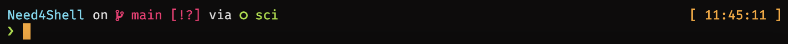

# Need4Shell

The only configuration guide you need for shell.

## Steps

1. Install Oh-My-Zsh

    ```shell
    sh -c "$(wget https://raw.githubusercontent.com/ohmyzsh/ohmyzsh/master/tools/install.sh -O -)"
    ```

2. Install Starship
   
   Starship can be installed on Linux and macOS with one simple command:
   ```shell
   curl -k -sS https://starship.rs/install.sh | sh
   ```
   Note: Curl's verification of certificate is turned off in this command.

   This command will place the Starship binary in `/usr/local/bin` by default. If you'd like to place the binary somewhere else, specify the `--bin-dir` option:
   ```shell
   wget https://starship.rs/install.sh
   sh ./install.sh --bin-dir "your custom bin directory"
   ```
   Also, remember to add the custom bin directory to your `$PATH` variable.

3. Configure Starship
   
   By default, you need to create `~/.config/starship.toml` first and put in any config you want with:

   ```shell
   vim ~/.config/starship.toml
   ```
   
   Alternatively, you can just copy the `starship.toml` in this repository to `~/.config/starship.toml`:
   ```shell  
   cp starship.toml ~/.config/starship.toml
   ```
   If you are using our config file, please make sure you have installed **any Nerd font** in your system. If not, you can download one from [here](https://www.nerdfonts.com/font-downloads).
   
   Here is a preview of shell prompt with our configuration file:
   
   
   If you use conda, you may want to disable the default conda prompt change. To do so, just run: 
   ```shell
   conda config --set changeps1 False
   ```

## Others

- We provide a [Monokai Pro based color scheme](Monokai_Pro_Material.icls) for JetBrains IDEs in this repository.


---

If you find this repository useful, please give us a **star**. Thank you!